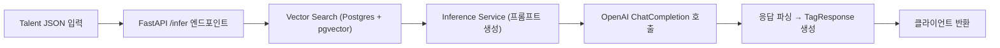

## AI-BE-Technical-Assignment

이 저장소는 SearcHRight AI 백엔드 기술 과제를 위한 코드베이스입니다.
원본 과제 안내는 `docs/assignment.md`를 참고하세요.

---

## 🚀 프로젝트 목적

* **목표**: 회사·재직기간·타이틀 정보만으로 지원자의 경험/역량을 자동으로 추론해 태그화된 리스트를 반환하는 REST API 구현
* **기술 스택**: FastAPI, PostgreSQL + pgvector, OpenAI GPT, Docker Compose, Nginx, pytest

---

## 📂 주요 디렉터리 구조

```
├── app/                      # FastAPI 애플리케이션 코드
│   ├── main.py               # 엔트리포인트
│   ├── deps.py               # DI(의존성) 설정
│   ├── schemas.py            # Pydantic 스키마
│   └── services/             # 핵심 로직
│       ├── vector_search.py  # 벡터 검색 로직
│       └── inference.py      # LLM 기반 태그 추론 서비스
├── example_datas/            # 샘플 JSON 및 데이터 세팅 스크립트
│   ├── setup_company_data.py
│   ├── setup_company_news_data.py
│   ├── talent_ex1.json
│   ├── talent_ex2.json
│   ├── talent_ex3.json
│   └── talent_ex4.json
├── scripts/                  # 초기화 및 임베딩 스크립트
│   ├── init_db.py            # 스키마·인덱스 생성 스크립트
│   └── embed_docs.py         # 벡터 임베딩 삽입 스크립트
├── tests/                    # 테스트 코드
│   ├── conftest.py
│   └── test_inference.py
├── nginx/                    # Nginx 리버스 프록시 설정
│   └── default.conf
├── Dockerfile                # API 서비스 이미지 정의
├── entrypoint.sh             # 컨테이너 기동 시 자동 실행 스크립트
├── docker-compose.yml        # 전체 서비스 오케스트레이션
├── pyproject.toml
└── README.md                 # (이 파일)
```

---

## 전체 아키텍처 흐름



---

## 🐳 Docker Compose 기동 (자동화)

```bash
docker compose up -d --build
```

1. **init_db.py 실행**
   - `vector` 확장 설치
   - `company`, `company_news`, `company_docs` 테이블 및 인덱스 생성
2. **example_datas/setup_company_data.py**, `setup_company_news_data.py` 실행
   - `company`, `company_news` 테이블에 예제 데이터 삽입
3. **scripts/embed_docs.py 실행**
   - `company_docs` 테이블에 텍스트 → 임베딩 변환 후 삽입
4. **FastAPI 서버 시작**
   - `uvicorn app.main:app --host 0.0.0.0 --port 9000`

이제 `http://localhost:8000/infer` 로 바로 API를 호출해 보실 수 있습니다.

* **Postgres**: pgvector 확장 포함
* **API**: 9000 포트
* **Nginx**: 8000 → API(9000) 프록시

> **참고**: 초기 임베딩 수행 시 시간이 소요될 수 있습니다. 로컬 개발 중에는 `docker compose run api-service sh` 로 진입해 embed 단계만 건너뛰고 서버를 테스트할 수 있습니다.

---

## API 문서

* Swagger UI: `http://localhost:9000/docs`
* ReDoc:        `http://localhost:9000/redoc`

---

## ✅ 단위 & 통합 테스트

```bash
poetry run pytest -q --disable-warnings --maxfail=1
```

* `tests/test_inference.py` 에서 샘플 3건에 대해 최소 태그(`상위권대학교`, `리더쉽`, 등) 포함 여부 자동 검증
* OpenAI 호출은 `pytest-mock` 또는 `respx` 로 Mocking 처리

---

## 📦 CI/CD & 배포

* `.github/workflows/ci.yml` 에 **테스트** 및 **Docker 빌드** 설정 완료
* `docker-compose.yml` 로 로컬 및 스테이징 배포 지원

---

## 🚧 TODO (향후 개선 사항)

* **ORM 통합**: 현재 `psycopg` 직접 SQL을 사용 중인 `embed_docs.py`와 `vector_search.py`를 SQLAlchemy ORM 매핑으로 전환
* **모니터링 & 로깅 개선**: Prometheus 메트릭, Grafana 대시보드 통합
