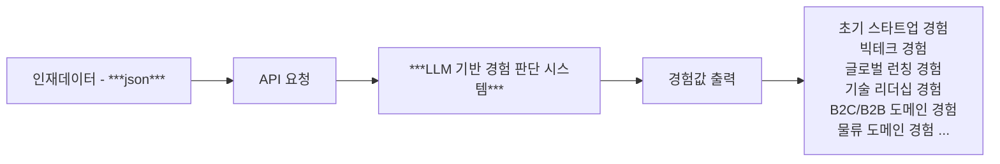
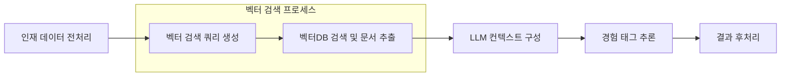

# SearcHRight AI Technical Assignment

> 서치라이트 에이아이, AI 관련 직무 기술 과제 및 프로젝트

## 목표

> **_회사, 재직기간, 직무(타이틀) 만 인재 데이터를 기반으로 LLM 을 활용하여 어떤 경험을 했는지, 어떤 역량을 가지고 있는지 추론하기_**

1. 인재 데이터 example 3 건 제공합니다.
2. 그 인재 데이터들의 회사 데이터 (뉴스, 재직자 수 변동, 자본금 변동, 투자 라운드 정보) 제공합니다.
   - 만약 더 필요하다면, 외부 데이터를 추가하거나 합치는 것은 상관 없습니다.
   - 원본 데이터를 변형해도 무방합니다.
   - **하지만 추가 또는 변동한 데이터에 대한 "객관적인 사실" 정보가 필요합니다. (출처 등)**
3. LLM 중 OpenAI 의 token 제공합니다.
   - 혹시 모를 탈취, 이슈, 보안 등의 이유로 토큰 사용 비용은 x 원으로 제한되어 있습니다.

## 세부 사항

### 1) 기본 input 과 output flow

#### _"LLM 기반 경험 판단 시스템" 내부 로직_

- test set & example 인재 데이터의 외부 데이터는 모두 백터DBMS 에 저장되어 있음 [(기본 세팅 정보 참조)]()

### 2) 제한 사항

1. `Flask` / `Django` / `FastAPI` 셋 중 하나를 사용해 주세요.
2. "목표" 를 이루기 위해 어떠한 형태의 비즈니스 로직이어도 상관 없습니다.
3. 핵심 비즈니스 로직에 대한 테스트 코드는 존재해야 합니다. **최소한의 "단위테스트" 를 작성해주세요.**
4. 만약 `MCP` 형태로 구성하거나 또는 `LangChain` 등의 `LLM` 전용 프레임워크를 사용하신다면 README 에 `flow chart` 를 꼭 추가해주세요.
   - 또는 step by step 으로 글로만 작성해도 무방합니다.
5. 어떤 base 모델을 활용하던 상관 없습니다. **하지만 제공되는 토큰은 OpenAI (gpt 계열 모델) 만 제공됩니다.**

### 3) 성공 테스트셋

1. input `talent_ex1.json`

   - output
     - **`상위권대학교`** (연세대학교)
     - **`성장기스타트업 경험`** (토스 16년도 부터 19년까지 투자 규모 2배 이상 성장, 조직 규모 2배 이상 성장)
     - **`리더쉽`** (타이틀, 챕터 리드, 테크 리드 기반으로 추론)
     - **`대용량데이터처리경험`** (네이버 AI가 21년 부터 하이퍼크로바까지 NLP 관련 처리 많이함)

2. input `talent_ex2.json`

   - output
     - **`상위권대학교`** (서울대학교)
     - **`대규모 회사 경험`** (KT 전략기획실, KT 미디어 사업부 성장전략 팀장 경험)
     - **`리더쉽`** (타이틀, CFO, 성장전략 팀장 경험 기반으로 추론)
     - **`IPO`** (밀리의 서재 CFO 재직 당시, 밀리의 서재가 IPO를 함)
     - **`M&A 경험`** (지니뮤직에서 밀리의 서재 인수 리드)

3. input `talent_ex3.json`

   - output
     - **`상위권대학교`** (연세대학교)
     - **`대규모 회사 경험`** (삼성전자, SKT)
     - **`M&A 경험`** (요기요 재직 중 사모펀드에 매각)
     - **`리더쉽`** (타이틀, CPO 경험 다수, 창업)
     - **`신규 투자 유치 경험`** (C level 재직기간 중 회사 신규 투자유치, Kasa Korea, LBox)

### 4) 목표 데이터 셋

- `talent_ex4.json` 을 API body (`payload`) 값으로 요청했을때 ... 이 output (`response`) 로 돌아와야 합니다.

## 기본 세팅 정보

- `python` 3.13 이상 버전 사용 (`pyenv`)
- `poetry` 사용 (다른 가상환경, 패키지 매니저로 변경해도 무방하나, 라이브러리 버전에 유의해야 함)
  - `requirements.txt` 는 제공되지 않습니다. `poetry` 를 사용하지 않는다면, `pyproject.toml` 를 참조해주세요.

### 1) 사전 데이터 세팅하기

> 가상환경과 docker compose 를 실행한 상태에서 아래 커멘드, 사전 세팅을 F/U 해주셔야 정상 작동 합니다.

1. `python ./example_datas/setup_company_data.py`
2. 

## QnA

1. 사전 데이터에 특정 회사가 없다면

   - 의도적으로 제외 시킨 회사 정보입니다. Base Model (LLM) 의 추론에 기대해도 괜찮고 직접 특정 외부 데이터를 일부분만 활용해도 괜찮습니다.

2. "성공 테스트셋" 에서 기대되는 결과 그 이상의 값을 output 으로 만들어도 되나요?

   - 네, 테스트셋의 output 은 최소한으로 꼭 판단되어야 하는 tag 에 대한 명시입니다.

3. 요청할때마다 output 이 달라져도 되나요?

   - 네, 하지만 위 2번에서 말한것과 같이 최소한으로 꼭 판단되어야 하는 tag는 동일해야 합니다.
